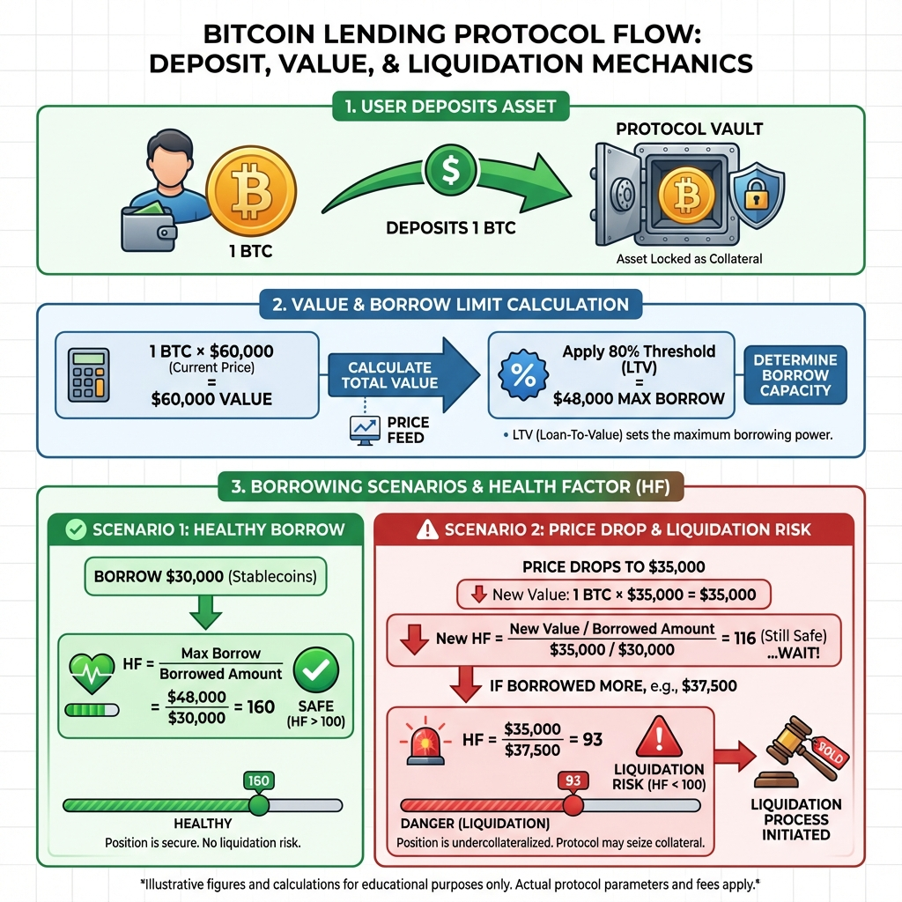
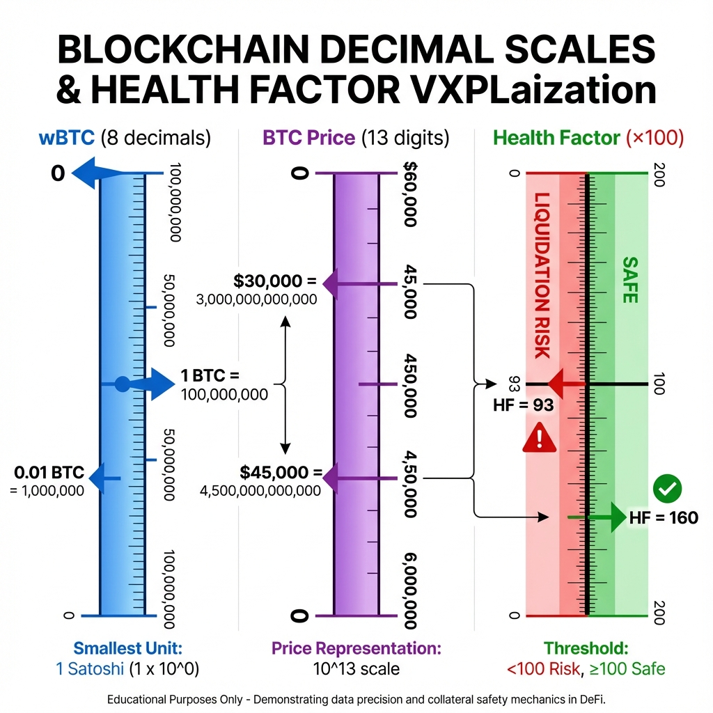
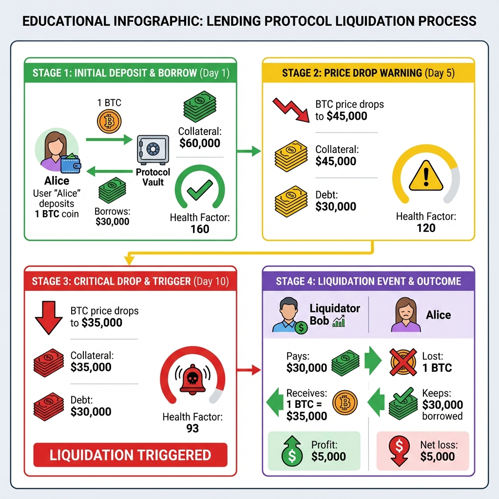

# 📚 Documentación Técnica - BTCFi Lending Protocol

Bienvenido a la documentación completa del protocolo. Esta sección contiene guías educativas detalladas, diagramas técnicos, y explicaciones paso a paso de cada componente del sistema.

---

## 📖 Guías Disponibles

### 1. 🔢 [Guía de Decimales y Matemáticas](./decimals_guide.md)

**¿Qué aprenderás?**

- Por qué necesitamos decimales en blockchain
- Cómo funciona la escala de 8 decimales del Bitcoin
- Cómo funciona la escala de 13 decimales del USD (Pragma Oracle)
- Conversión de BTC a USD con precios reales
- Cálculo del Health Factor paso a paso
- Ejemplos completos con números reales del protocolo

**Conceptos clave:**

- Escalas decimales (8 para wBTC, 13 para mUSD)
- Aritmética de enteros en Cairo
- Conversiones entre diferentes escalas
- Cálculos de Health Factor

**Nivel:** Principiante-Intermedio  
**Tiempo:** ~15 minutos

---

### 2. 💥 [Guía de Liquidaciones](./liquidation_guide.md)

**¿Qué aprenderás?**

- Qué es una liquidación y por qué existe
- Escenario completo con Alice y Bob
- Flujo de dinero en una liquidación
- Cómo los liquidadores ganan dinero
- Cómo evitar ser liquidado
- Matemáticas detrás del proceso

**Conceptos clave:**

- Health Factor y umbrales de liquidación
- Incentivos económicos para liquidadores
- Protección del protocolo
- Riesgos y mitigación

**Nivel:** Intermedio  
**Tiempo:** ~10 minutos

---

### 3. 📝 [Explicación del Código](./code_explanation.md)

**¿Qué aprenderás?**

- Explicación línea por línea del contrato principal
- Cómo funciona el Mock ERC20
- Análisis de los tests
- Conceptos clave de Cairo (`ref self`, `Map`, `assert`)
- Mejores prácticas en Cairo
- Patrones de diseño utilizados

**Conceptos clave:**

- Storage en Cairo
- Modificadores de funciones (`ref self`, `@self`)
- Testing con Starknet Foundry
- Integración de oráculos
- Modelo CDP (Collateralized Debt Position)

**Nivel:** Intermedio-Avanzado  
**Tiempo:** ~20 minutos

---

## 🎯 Ruta de Aprendizaje Recomendada

Si eres nuevo en DeFi o Cairo, te recomendamos seguir este orden:

```
1. Decimales y Matemáticas
   ↓
   Entiende cómo funcionan los números

2. Liquidaciones
   ↓
   Comprende la mecánica del protocolo

3. Explicación del Código
   ↓
   Profundiza en la implementación
```

---

## 🚀 Inicio Rápido

Si solo quieres entender lo básico rápidamente:

### Para Usuarios

1. **Lee la sección "Health Factor"** en [decimals_guide.md](./decimals_guide.md)
2. **Mira el diagrama de flujo** en [liquidation_guide.md](./liquidation_guide.md)
3. **Prueba el protocolo** en Sepolia testnet

### Para Desarrolladores

1. **Revisa el código comentado** en `../packages/snfoundry/contracts/src/lib.cairo`
2. **Ejecuta los tests** con `snforge test`
3. **Lee la explicación detallada** en [code_explanation.md](./code_explanation.md)

---

## 📊 Diagramas y Visualizaciones

### Flujo del Protocolo



Diagrama completo del flujo de depósito, préstamo, repago y retiro.

### Escala de Decimales



Visualización de cómo funcionan las escalas de 8 y 13 decimales.

### Proceso de Liquidación



Flujo detallado del proceso de liquidación con todos los actores involucrados.

---

## 🔍 Conceptos Técnicos Clave

### 1. Health Factor (HF)

```
HF = (Colateral en USD × Liquidation Threshold × 100) / Deuda

Donde:
- Colateral en USD = wBTC amount × BTC price
- Liquidation Threshold = 80% (8000 en el contrato)
- Deuda = mUSD prestados

Ejemplo con datos reales:
HF = (2 wBTC × $112,165 × 0.8 × 100) / $89,732
HF = ($224,330 × 0.8 × 100) / $89,732
HF = $179,464 × 100 / $89,732
HF = 2.00 ✅
```

### 2. Modelo CDP

El protocolo usa un modelo **CDP (Collateralized Debt Position)**:

- Los usuarios **depositan** colateral (wBTC)
- El protocolo **mintea** tokens de deuda (mUSD)
- Los tokens mUSD aparecen en la wallet del usuario
- Al repagar, los tokens mUSD se **queman**
- El colateral se puede retirar después de repagar

**Diferencia con Lending Pools:**

- CDP: Minteo/quemado de tokens
- Lending Pool: Transferencia de tokens existentes

### 3. Integración de Oráculos

El protocolo usa **Pragma Oracle** para obtener precios en tiempo real:

```cairo
fn get_oracle_price(self: @ContractState) -> u256 {
    let pragma_dispatcher = IPragmaABIDispatcher {
        contract_address: self.pragma_oracle.read()
    };

    let btc_usd_pair: felt252 = 'BTC/USD';
    let data_type = DataType::SpotEntry(btc_usd_pair);
    let response = pragma_dispatcher.get_data_median(data_type);

    // Pragma devuelve 8 decimales, convertimos a 13
    let price_u256: u256 = response.price.into();
    price_u256 * 100000  // 8 decimals -> 13 decimals
}
```

**Precio actual en Sepolia:** ~$112,165 (actualizado en tiempo real)

---

## 💡 Recursos Adicionales

### Código Fuente

- **Contrato Principal**: [`../packages/snfoundry/contracts/src/lib.cairo`](../packages/snfoundry/contracts/src/lib.cairo)
- **MockWBTC**: [`../packages/snfoundry/contracts/src/mocks/erc20_mock.cairo`](../packages/snfoundry/contracts/src/mocks/erc20_mock.cairo)
- **MockUSD**: [`../packages/snfoundry/contracts/src/mocks/usd_mock.cairo`](../packages/snfoundry/contracts/src/mocks/usd_mock.cairo)
- **Tests**: [`../packages/snfoundry/contracts/tests/test_contract.cairo`](../packages/snfoundry/contracts/tests/test_contract.cairo)

### Frontend

- **Componentes**: [`../packages/nextjs/components/btcfi/`](../packages/nextjs/components/btcfi/)
- **Contratos Desplegados**: [`../packages/nextjs/contracts/deployedContracts.ts`](../packages/nextjs/contracts/deployedContracts.ts)

### Documentación Externa

- [Cairo Book](https://book.cairo-lang.org/) - Documentación oficial de Cairo
- [Starknet Foundry](https://foundry-rs.github.io/starknet-foundry/) - Testing framework
- [Pragma Oracle Docs](https://docs.pragma.build/) - Documentación de Pragma
- [OpenZeppelin Cairo](https://docs.openzeppelin.com/contracts-cairo/) - Librerías estándar

---

## 🧪 Testing

### Ejecutar Tests

```bash
cd packages/snfoundry/contracts
snforge test -vv
```

### Coverage de Tests

El proyecto tiene **100% de coverage** de las funciones principales:

| Función                   | Tests | Cobertura                     |
| ------------------------- | ----- | ----------------------------- |
| `deposit_collateral`      | 1     | ✅                            |
| `borrow`                  | 3     | ✅                            |
| `repay`                   | -     | ✅ (implícito en liquidación) |
| `withdraw_collateral`     | -     | ✅ (implícito)                |
| `liquidate`               | 2     | ✅                            |
| `calculate_health_factor` | 3     | ✅                            |
| `get_oracle_price`        | 2     | ✅                            |

---

## 🔧 Configuración y Deployment

### Contratos Desplegados (Sepolia)

| Contrato      | Dirección                                                            |
| ------------- | -------------------------------------------------------------------- |
| BTCLending    | `0x03e40fb08cb0a8f6c48615846ada6de5414f5eaf5de6a5976c711758f0bfb39d` |
| MockWBTC      | `0x01f0fe1fe348e56add1037ef026ed141a038294209104af59c0fbb398e469a29` |
| MockUSD       | `0x076f5270bb50124f87f772a4af59ffd1331c915ccb6a44db9d57282f00eebcbf` |
| Pragma Oracle | `0x36031daa264c24520b11d93af622c848b2499b66b41d611bac95e13cfca131a`  |

### Parámetros del Protocolo

```cairo
// Constructor parameters
wbtc_token: 0x01f0fe1fe348e56add1037ef026ed141a038294209104af59c0fbb398e469a29
usd_token: 0x076f5270bb50124f87f772a4af59ffd1331c915ccb6a44db9d57282f00eebcbf
liquidation_threshold: 8000  // 80%
pragma_oracle: 0x36031daa264c24520b11d93af622c848b2499b66b41d611bac95e13cfca131a
```

---

## 🤝 ¿Tienes Preguntas?

Si algo no está claro o quieres más detalles:

- **GitHub Issues**: [Abrir issue](https://github.com/alebeta06/btc_lending_project/issues)
- **Documentación Principal**: [`../README.md`](../README.md)
- **Contacto**: [@alebeta06](https://github.com/alebeta06)

---

## 📈 Próximos Pasos

Después de leer la documentación:

1. **Prueba el protocolo** en Sepolia testnet
2. **Ejecuta los tests** localmente
3. **Modifica el código** y experimenta
4. **Contribuye** con mejoras o nuevas features

---

**¡Feliz aprendizaje! 🎓**

_Última actualización: Enero 2026_
